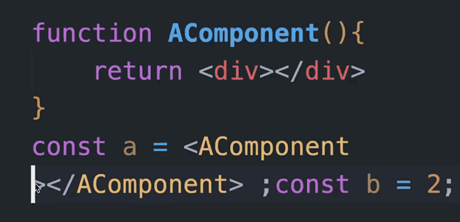

# jsx-self-closing-tag 

Help you auto close the self-closing tag in TSX / JSX when you input a '/'

## Features

See the demo.gif:

## Requirements

VS Code 1.52.0+

## Extension Settings

Nothing.

## Known Issues

None.

## Release Notes

[See in Changelog.md](./CHANGELOG.md)

**Enjoy!**
